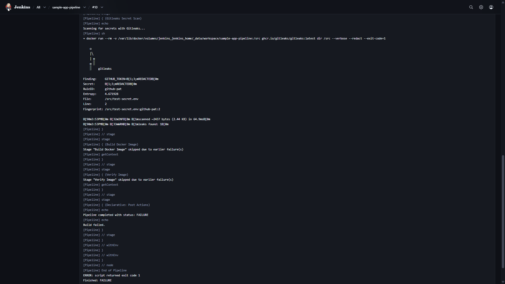
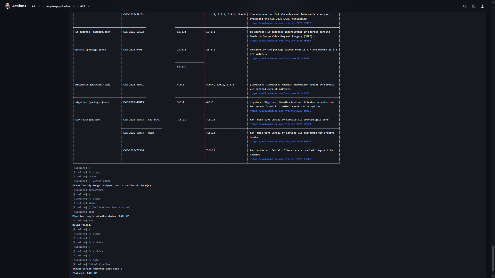
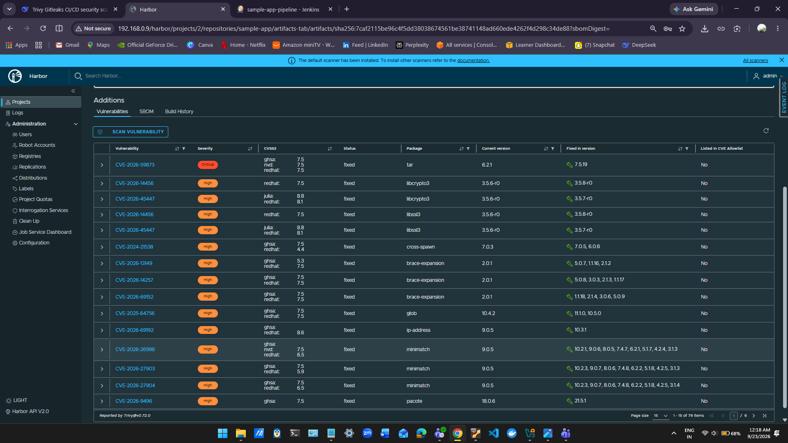
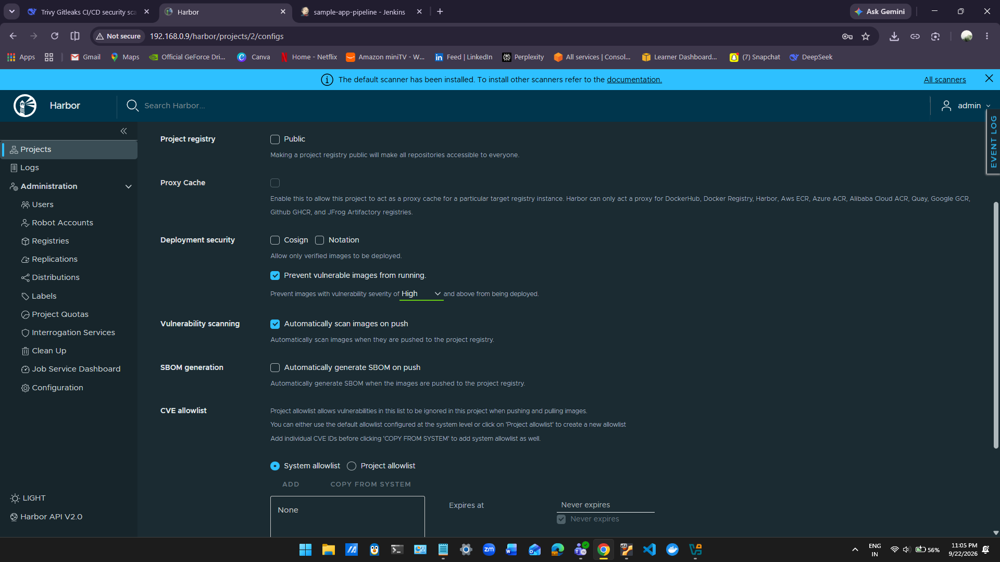

# R&D: Trivy & Gitleaks on CI/CD Pipeline

> **Research and integration of Trivy (container vulnerability scanning) and Gitleaks (secret detection) into a Jenkins CI/CD pipeline, with Harbor registry security gates for Nomad deployments.**

📄 **[Full Report (PDF)](docs/R%26D_Report.pdf)**

---

## 📋 Table of Contents

- [Overview](#-overview)
- [Architecture](#-architecture)
- [Tool Stack](#-tool-stack)
- [Pipeline Stages](#-pipeline-stages)
- [Security Gates](#-security-gates)
- [Proof of Concept — Gitleaks](#-proof-of-concept--gitleaks)
- [Proof of Concept — Trivy (CI)](#-proof-of-concept--trivy-ci)
- [Proof of Concept — Harbor (Registry)](#-proof-of-concept--harbor-registry)
- [Evidence](#-evidence)
- [Findings](#-findings)
- [Recommendations](#-recommendations)
- [Limitations](#-limitations)

---

## 🎯 Overview

This project delivers a **DevSecOps proof-of-concept** that integrates two widely adopted security tools into a Jenkins CI/CD pipeline:

| Tool | Purpose |
| :--- | :--- |
| **Gitleaks** | Detects hardcoded secrets (API keys, tokens, credentials) in source code |
| **Trivy** | Scans container images for OS and application-layer CVEs |

The pipeline enforces security gates at **three layers**:

1. **CI Layer (Jenkins) — Gitleaks** — blocks the build before any artifact is produced
2. **CI Layer (Jenkins) — Trivy** — blocks the build on HIGH/CRITICAL CVEs
3. **Registry Layer (Harbor)** — auto-scans on push and prevents vulnerable images from running

---

## 🏗️ Architecture
Developer ──► GitHub ──► Jenkins ──► Gitleaks ──► Docker Build ──► Trivy ──► Harbor ──► Nomad
(CI) (Gate 1) (artifact) (Gate 2) (Gate 3) (deploy)

text

**Flow:**

1. Developer pushes code to GitHub
2. Jenkins pulls the repo and runs the pipeline
3. **Stage 1 — Gitleaks:** scans source for secrets → blocks if found
4. **Stage 2 — Docker Build:** builds the container image
5. **Stage 3 — Trivy:** scans the image for HIGH/CRITICAL CVEs → blocks if found
6. **Stage 4 — Verify:** runs the image to confirm it works
7. **(Future) Harbor Push:** image is pushed to Harbor for registry-level scanning
8. **(Future) Nomad Deploy:** Harbor's pull-prevention policy blocks vulnerable images

---

## 🧰 Tool Stack

| Component | Version | Role |
| :--- | :--- | :--- |
| **Jenkins** | 2.568.3 (LTS, JDK 21) | CI orchestration |
| **Gitleaks** | latest (`ghcr.io/gitleaks/gitleaks`) | Secret detection |
| **Trivy** | v0.72.0 | Vulnerability scanning |
| **Harbor** | v2.15.2 (with Trivy adapter) | Container registry + registry-level scanning |
| **Docker** | 29.1.3 | Container runtime |

---

## 🔄 Pipeline Stages

| Stage | Tool | Gate Behavior |
| :--- | :--- | :--- |
| **Checkout** | Git | Pulls code from GitHub |
| **Gitleaks Secret Scan** | Gitleaks | ❌ Blocks build on any secret |
| **Build Docker Image** | Docker | Builds the container image |
| **Trivy Image Scan** | Trivy | ❌ Blocks build on HIGH/CRITICAL CVEs |
| **Verify Image** | Docker | Confirms image runs |

---

## 🛡️ Security Gates

### Gate 1 — Gitleaks (CI)

| Property | Value |
| :--- | :--- |
| **Trigger** | Any commit to `main` |
| **Scan Scope** | Full working directory |
| **Blocking Condition** | Any secret detected |
| **Action** | ❌ Block build — no artifact produced |

### Gate 2 — Trivy (CI)

| Property | Value |
| :--- | :--- |
| **Trigger** | After Docker image build |
| **Scan Scope** | Container image (OS + app packages) |
| **Severity Threshold** | `HIGH`, `CRITICAL` |
| **Action** | ❌ Block build — image not pushed |

### Gate 3 — Harbor (Registry)

| Property | Value |
| :--- | :--- |
| **Trigger** | Every image push |
| **Scan Scope** | Container image (registry-level) |
| **Severity Threshold** | `High` |
| **Action** | ❌ Prevent vulnerable images from running |
| **Auto-Scan** | ✅ Enabled |

---

## 🎯 Proof of Concept — Gitleaks

### Test

Planted a fake high-entropy GitHub Personal Access Token (`ghp_...`) in `test-secret.env`, committed, and triggered a Jenkins build.

### Result — ✅ **BUILD BLOCKED**
Finding: GITHUB_TOKEN=REDACTED
RuleID: github-pat
Entropy: 4.671928
File: /src/test-secret.env
Line: 2

leaks found: 1
ERROR: script returned exit code 1
Finished: FAILURE

text

**Downstream stages skipped:** `Build Docker Image`, `Verify Image`

---

## 🐳 Proof of Concept — Trivy (CI)

### Test

Built the `sample-app` image from `node:20-alpine` base and scanned it with `--severity HIGH,CRITICAL`.

### Result — ✅ **BUILD BLOCKED**

Trivy detected **24 HIGH/CRITICAL CVEs** across Alpine OS packages and Node.js dependencies.

**Critical finding:**
CVE-2026-59873 CRITICAL tar 6.2.1 → 7.5.19
"Denial of Service via crafted gzip bomb"

text

---

## 🏛️ Proof of Concept — Harbor (Registry)

### Setup

Harbor v2.15.2 installed with `--with-trivy`. Project `sample-app` configured with:
- ✅ Automatically scan images on push
- ✅ Prevent vulnerable images from running at severity **High**

### Result — ✅ **79 VULNERABILITIES DETECTED**

| Severity | Count |
| :--- | :--- |
| Critical | 1 |
| High | 78 |
| **Total** | **79 (all fixable)** |

---

## 📸 Evidence

All screenshots are in the [`screenshots/`](screenshots/) folder:

### Jenkins Evidence

| File | Description |
| :--- | :--- |
| [`evidence-jenkins-build-history.png`](screenshots/evidence-jenkins-build-history.png) | Full build history |
| [`evidence-jenkins-build-trend.png`](screenshots/evidence-jenkins-build-trend.png) | Build duration chart |
| [`evidence-jenkins-all-stages.png`](screenshots/evidence-jenkins-all-stages.png) | Pipeline stages across all builds |
| [`evidence-jenkins-gitleaks-failed.png`](screenshots/evidence-jenkins-gitleaks-failed.png) | **Gitleaks blocking build** |
| [`evidence-jenkins-trivy-command.png`](screenshots/evidence-jenkins-trivy-command.png) | Trivy scan command |
| [`evidence-jenkins-trivy-failed.png`](screenshots/evidence-jenkins-trivy-failed.png) | **Trivy blocking build** |
| [`evidence-jenkins-passing-build.png`](screenshots/evidence-jenkins-passing-build.png) | Passing pipeline |

### Harbor Evidence

| File | Description |
| :--- | :--- |
| [`evidence-harbor-project-policies.png`](screenshots/evidence-harbor-project-policies.png) | Security policies |
| [`evidence-harbor-trivy-vulnerabilities.png`](screenshots/evidence-harbor-trivy-vulnerabilities.png) | 79 CVEs detected |
| [`evidence-harbor-artifacts-page.png`](screenshots/evidence-harbor-artifacts-page.png) | Artifacts with CVE badge |

---

## 🔍 Findings

### Gitleaks

**Strengths:**
- ✅ Fast (~100 ms on small repos), lightweight (~50 MB)
- ✅ High-entropy detection reduces false positives
- ✅ Multi-source pattern library (AWS, GitHub, Stripe, etc.)
- ✅ Works as pre-commit hook or CI stage

**Limitations:**
- ⚠️ Custom rules needed for org-specific patterns
- ⚠️ Scans text only (no binary detection)
- ⚠️ Does not scan inside container images

### Trivy

**Strengths:**
- ✅ Multi-source vulnerability DB (NVD, GHSA, Red Hat, Alpine, etc.)
- ✅ Covers OS + language packages in one scan
- ✅ Native Harbor integration
- ✅ JSON, SARIF, table output formats

**Limitations:**
- ⚠️ No reachability analysis — reports all CVEs
- ⚠️ First run slow (DB download ~50 MB)
- ⚠️ Needs Docker socket mount when run in container

### Harbor

**Strengths:**
- ✅ Independent verification layer
- ✅ Detects newly disclosed CVEs after push
- ✅ Project-level policies

**Limitations:**
- ⚠️ Resource-heavy (~2–3 GB RAM)
- ⚠️ Pull prevention requires orchestrator admission controller
- ⚠️ Requires TLS in production

---

## 💡 Recommendations

### Adopt Now

1. **Gitleaks as pre-commit hook + CI gate** — cheapest, fastest impact
2. **Trivy in CI with HIGH/CRITICAL blocking** — block only on serious CVEs
3. **Harbor with auto-scan + pull prevention** — registry-level defense

### Longer-Term

4. Add SARIF output → GitHub Security tab
5. Implement documented `.trivyignore` policy
6. Add image signing (Cosign) + SBOM generation
7. Nomad admission controller + Harbor webhook

---

## ⚠️ Limitations

This PoC is for **research and validation** — not production:

| Area | PoC State | Production Need |
| :--- | :--- | :--- |
| Harbor TLS | HTTP only | HTTPS + valid certs |
| Jenkins auth | Local user | SSO / LDAP |
| Credentials | Jenkins store | Vault |
| Nomad integration | Not implemented | Admission controller |
| Triggers | Manual "Build Now" | GitHub webhook |

---

## 📁 Repository Structure
rnd-trivy-gitleaks-cicd-pipeline/
├── Jenkinsfile # CI pipeline (Gitleaks + Trivy + Build + Verify)
├── Dockerfile # Sample Node.js app
├── app.js # HTTP server
├── package.json # Dependencies
├── README.md # This file
├── docs/
│ └── R&D_Report.pdf # Full detailed report
└── screenshots/ # Evidence screenshots
├── evidence-jenkins-.png
└── evidence-harbor-.png

text

---

## 🔗 References

- [Trivy Documentation](https://trivy.dev/)
- [Gitleaks GitHub](https://github.com/gitleaks/gitleaks)
- [Harbor Documentation](https://goharbor.io/docs/)
- [Jenkins Pipeline Syntax](https://www.jenkins.io/doc/book/pipeline/syntax/)

---

*Prepared as part of R&D task: **Trivy & Gitleaks on CI/CD Pipeline** — September 2026*
